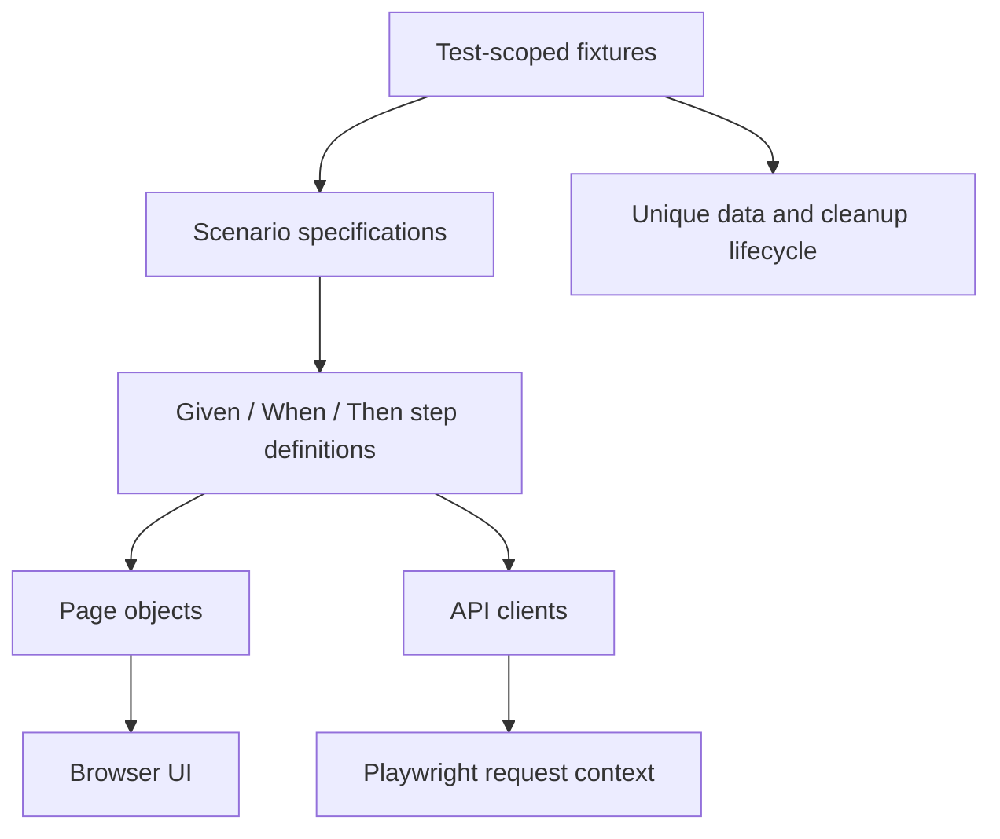

# Architecture and design decisions

## Scope

One TypeScript Playwright Test project implements the supplied debugging task, UI cases 1/2/3/15, and API cases 1/3/5/7/10. Supplemental security and performance projects are available through explicit commands. `npm test` selects only the required projects.

## Responsibilities

| Layer       | Owns                                                               | Does not own                                       |
| ----------- | ------------------------------------------------------------------ | -------------------------------------------------- |
| `tests/`    | Scenario intent, required case IDs, test data variations           | Selectors and HTTP mechanics                       |
| `steps/`    | Reusable Given/When/Then operations, report steps, business checks | Global mutable scenario state                      |
| `pages/`    | Page-specific actions, semantic locators, presentation checks      | Account provisioning and test runner configuration |
| `api/`      | Endpoint methods, form encoding, response parsing, runtime schemas | Hardcoded success assumptions for every call       |
| `fixtures/` | Per-test clients, page-step objects, account lifecycle             | Shared accounts across destructive tests           |
| `support/`  | Target validation, monetary parsing, response assertions, recovery | Application-specific catch-all utility classes     |

## Step definitions interpretation

The PDF requires “Step Definitions” but does not explicitly require Cucumber, Gherkin or `.feature` files. This implementation uses named reusable Given/When/Then methods wrapped in Playwright's native `test.step()`. UI and API follow the same convention. A `test.step()` label by itself is not a reusable definition; the classes supply the reusable method boundary.

If the assessor specifically expects Gherkin bindings, add that adapter after confirming the expectation. Reuse these page objects and clients; do not rewrite the application interaction layer. The current submission makes this assumption visible.

## Test isolation and data ownership

1. Each test gets its own browser context and API request fixture.
2. Each created user has a cryptographically random email identifier and password. Only synthetic profile and payment data are used.
3. TC01 and TC15 register in the UI because registration is part of those scenarios. TC02 and API07 provision through the API because account creation is a precondition there.
4. The API request fixture is separate from the browser context. API provisioning must not accidentally authenticate the browser and bypass the login being tested.
5. Cleanup is armed **before** the create mutation. Even an interrupted create can have succeeded on the server.
6. Teardown verifies the account state, deletes it if present, and verifies credentials are rejected afterwards. Required UI deletion steps still run in their own scenarios.
7. A cleanup failure fails the test and keeps a recovery file in `.runtime/`. It is not silently swallowed. Local files use restricted POSIX permissions and are excluded from Git and submission archives.
8. Forced process termination, machine loss or a hard CI timeout can prevent cleanup. `npm run cleanup` recovers retained local records. A production test tenant should additionally support expiry and a server-side janitor; this public API has no owned-account listing/TTL facility.

## Waiting and locators

Use the site's existing `data-qa` hooks for ambiguous form inputs and role/name locators for user-facing actions. Use verified stable IDs/classes where no meaningful accessible hook exists, such as address blocks and line-item totals. Keep those selectors inside page objects.

There are no `waitForTimeout()` calls in tests, forced clicks or “catch and continue” success paths. `domcontentloaded` starts navigation checks; locator assertions establish readiness. `networkidle` would be an unreliable readiness signal on a page that loads advertisements. The small delay in Q1 belongs to the simulated application, not to the test.

Optional ad filtering is disabled by default. If enabled with `BLOCK_ADS=1`, only known third-party ad hosts are blocked, and the run must be labelled accordingly. It cannot substantiate real-user page performance.

## Assertions and independent evidence

API assertions distinguish transport status, application `responseCode`, runtime schema and meaningful content. Search is parameterized with three terms. Product and brand IDs must be unique; counts must be non-zero without assuming a permanent catalog size.

Checkout selects two catalog products and quantities 2 and 1. UI prices are compared with the API, line totals are independently calculated in integer minor units, the grand total is summed, and both addresses must match the submitted profile. UI/API agreement is useful but not a fully independent pricing oracle: a shared backend defect could affect both. Production pricing tests would use approved fixed fixtures and an independent pricing specification.

`verifyLogin` reports whether credentials match; it does not establish or prove a browser session. UI login checks the correct displayed user. Order confirmation in this practice site does not prove real payment settlement or persisted order ownership because no suitable documented order API is available.

## Retries, concurrency and reporting

- Automatic retries are zero. Failures remain visible. If retries are later allowed, track the flaky rate and first-attempt failure rate separately, and use fresh data on each attempt.
- One worker is the default on the shared practice service. Tests are isolated and may be demonstrated with at most two workers; independence does not require aggressive load.
- Playwright reports include nested steps; API attachments contain only status, timing, media type and counts.
- Screenshots are retained on failure. Traces are opt-in because they include requests, cookies and DOM data. Avoid publishing reports from credential-bearing runs without inspecting them.
- Type checking is a separate gate. Playwright transpiles TypeScript but does not replace `tsc --noEmit`.
- CI uses a lockfile, least-privilege repository permissions, read-only checkout credentials and a final cleanup attempt. It does not automatically upload potentially sensitive browser artifacts.

## Browser strategy

Chromium covers the required assessment. Firefox and WebKit projects are defined for later compatibility runs; a configured project is not evidence it has passed. Browser installation, OS support and live third-party availability must be checked on the presentation machine in advance.

## Deliberate constraints

The test target is restricted to the assessment origin because registration, deletion and dummy checkout mutate data. This is a guard against an accidental production URL. Reusing the framework for ADAM requires a reviewed environment list and application-specific endpoints/selectors; changing `BASE_URL` alone is insufficient.

No application source code was supplied. This review covers the original snippet, this automation project and observed public behavior. It cannot assess backend password hashing, database queries, source-level authorization or infrastructure configuration.
